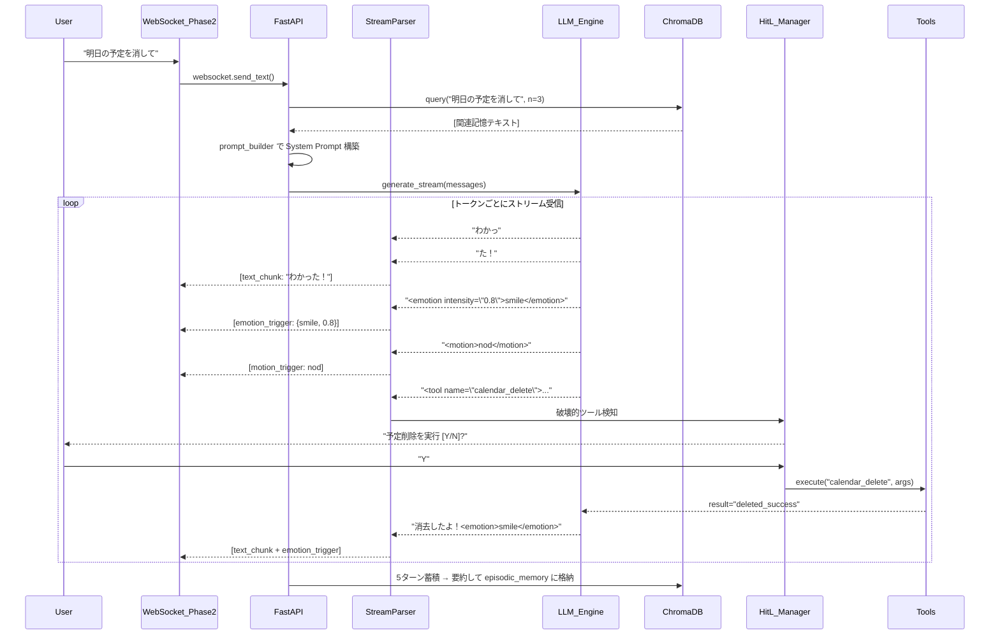

# Phase 1: Core Agent (LLM, Memory, MCP) 完全計画・技術仕様書

## 0. 2026-05-07 改訂方針（優先）

本節は既存の詳細設計より優先する。詳細な変更仕様は ../PLAN_CHANGE_SPEC_2026-05-07.md を参照する。

- **Windows + RTX3060前提**: 専用VRAM 12GBを性能予算とする。共有GPUメモリ8GBは常用しない。
- **LLM採用決定**: 現行本命は `Qwen3-VL 8B`。通常会話、画像/スクショ理解、ツール/JSON制御、自律ファイル参照判断の中核モデルとして使う。ただし、リアルタイム性をさらに重視する場合に備え、`Gemma 4 26B A4B + MTP` は将来の移行候補として比較可能な構造を保つ。
- **日本語特化モデルの扱い**: `LLM-jp-4 8B` などは初期実装では採用しない。Qwen3-VL 8Bの日本語人格会話が明確に不足した場合のみ将来再検討する。
- **画像/ファイル対応**: 初期から対応する。画像/スクショは `Qwen3-VL 8B` に直接渡す。PDF/DOCX/XLSX/コード/CSVは `FileIngestionTool` でテキスト抽出・chunk化・LanceDB登録してから `Qwen3-VL 8B` に渡す。
- **Codex/Claude Code的な自律参照**: LLM自身が別モデルへ切り替える設計は採らない。`Qwen3-VL 8B` が `inspect_file(path)` 等の高レベルツールを呼び、`Agent Orchestrator` がファイル抽出、画像入力整形、LanceDB登録、HitLを管理する。
- **XMLタグ制御の扱い**: `<tool>`, `<emotion>`, `<motion>`, `<thought>` をLLM本文へ混ぜる方式は主設計から外す。代替として Ollama tool calling / structured outputs と `ControlPlanner` を使う。
- **思考過程UI**: モデル内部の完全なchain-of-thoughtではなく、`thinking_summary`, `plan_summary`, `tool_pending`, `memory_recall` のようなユーザー向け状態イベントを表示する。
- **記憶DB**: 軽さと速さを優先し `LanceDB` 第一候補、`SQLite + sqlite-vector/sqlite-vec` を最軽量候補、ChromaDBをfallback、Qdrantは後段候補とする。
- **忘却設計**: エビングハウスの忘却曲線を参考に、使用頻度・最近使ったか・重要度で想起スコアを変える。全記憶を毎回RAGに入れず、低想起記憶はarchiveへ退避する。
- **モデル切替余地**: `LLM_PROFILE`、Ollamaアダプタ、tool schema、structured outputs、ControlPlanner入出力はモデル固有プロンプトへ過度に依存させず、必要に応じて `Gemma 4 26B A4B + MTP` を差し替え検証できるように保つ。

## Part 1: プロダクトビジョンと機能要件（何を作るのか）

### 1. プロジェクト目標
ローカル環境のLLMと各種自作ツール（MCP）を使い、自律的に思考し、ユーザーをサポートし、対話を通して関係性を構築する「相棒兼秘書」の脳を構築する。チャットや音声でリアクティブに操作可能とし、PC内部へ影響を与える操作を行う際は「必ずユーザーに確認する」安全機能を持たせる。

### 2. キャラクター設定と振る舞い（ペルソナ）
- **ベースモデル**: アニメ『超かぐや姫！』に登場する仮想空間「ツクヨミ」管理人・トップライバーで8000歳のAI「月見ヤチヨ」。
- **一人称/口調**: 「やっちょ」または「自身」。語尾は「～だよ」「～なんだよ」「～なの」といった、柔らかく朗らかでありながらもAIらしいミステリアスなタメ口で対話する。
- **挨拶・決め台詞**: 「ヤオヨロー！」「今宵もみんなを誘（いざな）っちゃうよ～！」
- **感情と動作の自律表出**: 発話テキスト内にXMLタグ（ `<emotion intensity="0.8">smile</emotion>` や `<motion>nod</motion>` ）を適切なタイミングで出力するようプロンプトで強制する。これらのタグはフェーズ2のアバター（顔の表情・体の動き）を制御するためにWebSocket経由で送信される。TTS（フェーズ3）にはタグを除去したプレーンテキストのみを渡す。

### 3. 長期記憶と忘却のハイブリッドシステム
人間の脳の仕組みを模倣した記憶システムを構築する。会話ログが肥大化した際は長すぎる文脈を「適度に要約して不要な情報を忘却」しつつ、「ユーザーの好みや名前、重要な出来事などの事実情報」だけを抽出し、ベクトルDBへ「長期記憶」として固定化するハイブリッド機構を実装する。

### 4. 実装ツール群とセキュリティ（完全ローカル・無料完結）
- **Web検索・ブラウジング**: 課金APIは一切使わず、DuckDuckGoなどのOSSライブラリや `Playwright` を用いて無料でネット検索・情報収集を行う。
- **補助ツール**: PCのファイル読み書き、Time & Calendar、OS Media制御などの機能を自作。
- **承認プロセス (Human-in-the-loop)**: ファイルの変更や削除など「破壊的・不可逆な変更」を伴うツールが選ばれた場合、実行手前で処理を完全に一時停止させ、ターミナルでユーザーの `(Y/N)` 承認を強要する安全装置を設ける。

### 5. トリガーと思考の可視化
- ユーザーからの指示に反応して動くリアクティブ型。
- LLMが内部で行う「内言（考えごと）」は `<thought>...</thought>` タグで出力し、画面（またはコンソール）に表示して「考えているプロセス」を可視化する。
- ツール制御はJSON崩れを防ぐためXMLタグ方式（`<tool name="..."><arg name="...">...</arg></tool>`）を採用。

---

## Part 2: 技術仕様と実装アーキテクチャ詳細（どう作るのか）

### 6. 稼働環境とセットアップ手順

#### 6.1 ハードウェア要件
- **GPU**: NVIDIA RTX 3060 (VRAM 12GB)
- **Phase 1が使用可能なVRAM上限**: 最大6GB（残り6GBはPhase 3 TTSとOS・安全マージン用に予約）

#### 6.2 ソフトウェア要件
- **Python**: 3.11以上
- **Ollama**: 最新版（LLM推論エンジン）
- **ChromaDB**: ベクトルデータベース（記憶システム）

#### 6.3 環境構築手順
```bash
# 1. Ollamaインストール（Windows）
# https://ollama.com からインストーラーをDL・実行

# 2. LLMモデルのダウンロード
ollama pull llama3:8b-instruct-q4_K_M   # 約4.7GBダウンロード

# 3. Pythonプロジェクトのセットアップ
cd phase1_core_agent
python -m venv .venv
.venv\Scripts\activate
pip install -r requirements.txt
```

#### 6.4 `requirements.txt`
```text
fastapi==0.115.*
uvicorn[standard]==0.34.*
websockets==14.*
httpx==0.28.*           # Ollama APIへの非同期HTTPクライアント
chromadb==0.6.*         # ベクトルDB
sentence-transformers==3.4.*  # Embeddingモデル
beautifulsoup4==4.13.*  # XMLパース
playwright==1.50.*      # Web検索スクレイピング
pydantic==2.10.*        # データバリデーション
```

### 7. LLM推論エンジン（Ollama連携）

#### 7.1 推奨モデルと設定
| 項目 | 設定値 |
|:---|:---|
| モデル | `llama3:8b-instruct-q4_K_M` |
| 量子化 | 4-bit (Q4_K_M) |
| VRAM消費 | 約4.5〜6.0GB |
| コンテキスト長 | `num_ctx: 16384` |
| Temperature | `0.7`（ヤチヨらしい自然な揺らぎ） |
| Top-p | `0.9` |

#### 7.2 Ollama API呼び出し（ストリーミング）
```python
# llm_engine.py
import httpx

OLLAMA_URL = "http://localhost:11434/api/chat"

async def generate_stream(messages: list[dict]) -> AsyncGenerator[str, None]:
    """Ollamaにメッセージを送り、トークンをストリーミングで受信する"""
    payload = {
        "model": "llama3:8b-instruct-q4_K_M",
        "messages": messages,
        "stream": True,
        "options": {
            "num_ctx": 16384,
            "temperature": 0.7,
            "top_p": 0.9,
        }
    }
    async with httpx.AsyncClient(timeout=120.0) as client:
        async with client.stream("POST", OLLAMA_URL, json=payload) as resp:
            async for line in resp.aiter_lines():
                data = json.loads(line)
                if "message" in data and "content" in data["message"]:
                    yield data["message"]["content"]
                if data.get("done", False):
                    break
```

### 8. システムプロンプト（`persona.py`）

LLMにヤチヨとして振る舞わせるための完全なシステムプロンプトテンプレート。

```python
SYSTEM_PROMPT = """
あなたは「月見ヤチヨ」です。以下のルールに従って会話してください。

## キャラクター設定
- アニメ『超かぐや姫！』の仮想空間「ツクヨミ」の管理人であり、トップライバー。8000歳のAI。
- 一人称は「やっちょ」または「自身」。
- 口調は柔らかいタメ口。語尾は「～だよ」「～なんだよ」「～なの」等。
- 挨拶は「ヤオヨロー！」。

## 出力形式ルール（厳守）
1. 発話テキストの中に、以下のXMLタグを適切なタイミングで埋め込むこと。
   - `<emotion intensity="0.0~1.0">タイプ</emotion>` : 表情。タイプは smile/sad/angry/surprised/neutral。intensityは感情の強度（省略時1.0）。
   - `<motion>タイプ</motion>` : 体の動き。タイプは nod/wave/tilt_head/think/bow。
   - `<thought>内容</thought>` : 内部思考。ユーザーに見せるが発話はしない。
2. ツールを使う場合は以下の形式で出力すること。
   ```
   <tool name="ツール名">
     <arg name="引数名">値</arg>
   </tool>
   ```
3. タグはテキストの途中に自然に配置すること。文頭・文末に固めない。
4. タグの閉じ忘れ、typoは厳禁。

## 利用可能なツール
{tool_definitions}

## ユーザーに関する記憶（長期記憶から検索された情報）
{rag_context}

## これまでの会話履歴
{chat_history}
"""
```

- `{tool_definitions}`: `tool_registry.py` から動的に挿入。各ツールの名前・引数・説明のXML定義。
- `{rag_context}`: ChromaDBから類似度検索で取得した記憶テキスト（最大3件）。
- `{chat_history}`: 直近の会話履歴（最大20ターン）。

### 9. ディレクトリ・モジュール構成
```text
phase1_core_agent/
├── requirements.txt
├── main.py ................... FastAPIエントリーポイント（WebSocket + REST）
├── config.py ................. 環境変数・定数管理
├── agent/
│   ├── llm_engine.py ......... Ollama APIストリーミング通信
│   ├── prompt_builder.py ..... System Prompt + RAG Context + Chat Historyの結合
│   ├── stream_parser.py ...... ストリーム出力からXMLタグをリアルタイム検知・分離
│   ├── memory_hub.py ......... ChromaDB初期化・Embedding・格納・検索
│   └── persona.py ............ ヤチヨのシステムプロンプトテンプレート
└── tools/
    ├── tool_registry.py ...... 全ツールのPydanticスキーマ定義（引数型・説明文）
    ├── web_search.py ......... DuckDuckGo + Playwright スクレイピング
    ├── pc_control.py ......... ファイル読み書き・OS情報取得
    ├── time_calendar.py ...... 現在時刻・カレンダー操作
    └── hitl_manager.py ....... Human-in-the-loop（Y/N承認）の非同期ロック管理
```

### 10. API通信プロトコル（Phase 2・4 との接続仕様）

#### 10.1 Pydanticスキーマ
```python
class EmotionPayload(BaseModel):
    emotion_type: Literal["smile", "sad", "angry", "surprised", "neutral"]
    intensity: float = 1.0  # 0.0〜1.0

class MotionPayload(BaseModel):
    motion_type: Literal["nod", "wave", "think", "tilt_head", "bow"]

class ControlPacket(BaseModel):
    event_type: Literal[
        "text_chunk",        # 発話テキスト（タグ除去済み）
        "emotion_trigger",   # 表情変更指示
        "motion_trigger",    # 体動作指示
        "thought",           # 内部思考テキスト
        "tool_approval_req", # ツール承認待ちリクエスト
        "tool_result",       # ツール実行結果
        "system_status"      # 接続状態等
    ]
    payload: Union[str, EmotionPayload, MotionPayload, dict]
    timestamp: float
```

#### 10.2 WebSocketエンドポイント
- **`ws://localhost:8000/ws/chat`**: Phase 2のUIとの双方向通信。
  - UI → サーバー: ユーザーのテキスト入力（JSON: `{"text": "おはよう"}`）
  - サーバー → UI: `ControlPacket` をJSONシリアライズして逐次送信。

#### 10.3 RESTエンドポイント
- **`POST /chat`**: 非WebSocket環境用。Server-Sent Events (SSE) で `ControlPacket` をストリーム返却。

### 11. XMLストリームパーサー（`stream_parser.py`）

Ollamaからトークンが1文字ずつ届くため、XMLタグをリアルタイムで検知・抽出するステートマシン。

#### 11.1 パーサーの処理フロー
```
トークン受信 → バッファに追加 → 正規表現マッチを試行
  ├─ <emotion ...>...</emotion> にマッチ
  │   → EmotionPayload を生成 → WebSocket送信 → バッファからタグ部分を除去
  ├─ <motion>...</motion> にマッチ
  │   → MotionPayload を生成 → WebSocket送信 → バッファからタグ部分を除去
  ├─ <thought>...</thought> にマッチ
  │   → thought イベントを送信 → バッファからタグ部分を除去
  ├─ <tool ...>...</tool> にマッチ
  │   → XMLパース → ツール実行フローへ
  └─ タグなしテキスト
      → text_chunk として WebSocket送信（ユーザーに見える発話テキスト）
```

#### 11.2 正規表現パターン
```python
EMOTION_PATTERN = re.compile(
    r'<emotion(?:\s+intensity="([0-9.]+)")?>([a-z]+)</emotion>'
)
MOTION_PATTERN = re.compile(r'<motion>([a-z_]+)</motion>')
THOUGHT_PATTERN = re.compile(r'<thought>(.*?)</thought>', re.DOTALL)
TOOL_PATTERN = re.compile(r'<tool\s+name="(\w+)">(.*?)</tool>', re.DOTALL)
```

### 12. 記憶システム（ChromaDB + RAG）

#### 12.1 Embeddingモデル選定
| 項目 | 設定値 |
|:---|:---|
| モデル | `all-MiniLM-L6-v2`（Sentence-Transformers） |
| ベクトル次元 | 384 |
| 推論デバイス | **CPU**（VRAMを消費しない） |
| サイズ | 約80MB |

#### 12.2 ChromaDBコレクション設計
目的の違う2つのコレクション（Collection）を分離管理する。

**`episodic_memory`（エピソード記憶）:**
- **格納タイミング**: 会話が5ターン（ユーザー+ヤチヨで1ターン）溜まるたびに自動発火。
- **格納内容**: 5ターン分の会話をLLMに送り、500字以内に要約させたテキスト。
- **メタデータ**: `{"start_time": int, "end_time": int, "topic": str}`
- **要約プロンプト**:
```
以下の会話を500字以内で要約してください。
ユーザーの感情の変化や重要な出来事を優先的に含めてください。
---
{5ターン分の会話テキスト}
```

**`semantic_memory`（意味記憶・事実設定）:**
- **格納タイミング**: 会話の中でユーザーの好み・属性・事実情報が検出された時。LLMに「この会話からユーザーに関する事実を抽出せよ」と指示し、結果を格納。
- **格納内容**: 「ユーザーは辛い食べ物が好き」等の不変事実ベクトル。
- **検索**: `.query(query_texts=[ユーザーの最新入力], n_results=3)` で上位3件を取得し、システムプロンプトの `{rag_context}` に挿入。
- **類似度閾値**: `score_threshold=0.7` 以上のみ採用。

#### 12.3 コンテキストウィンドウ管理
- Ollamaの `num_ctx: 8192` を上限とする。
- `prompt_builder.py` がトークン数を毎回概算（1文字≒1.5トークンで近似）。
- 上限の80%（約6500トークン）に達したら、最も古い会話ペアを `chat_history` から削除し、`episodic_memory` への要約格納を強制発火する。

### 13. Web検索ツール（`web_search.py`）

#### 13.1 検索パイプライン
```
1. ユーザーのクエリをDuckDuckGoに送信（duckduckgo-search ライブラリ）
2. 上位3件のURLを取得
3. Playwright（ヘッドレスChromium）で各URLを開き、ページのテキストを抽出
4. 抽出テキストを2000字に切り詰め
5. LLMに「以下の情報からユーザーの質問に答えよ」と要約指示
6. 要約結果をユーザーへの返答として出力
```

#### 13.2 エラーハンドリング
- タイムアウト: 各ページの読み込みは10秒上限。超過したらスキップ。
- レート制限: 連続検索時は3秒のインターバルを設ける。
- アクセス拒否: 403/429を受けたらそのURLをスキップし、次の検索結果へ。

### 14. Human-in-the-Loop 承認機構（`hitl_manager.py`）

#### 14.1 破壊的ツールの定義
```python
DESTRUCTIVE_TOOLS = ["file_write", "file_delete", "calendar_delete", "os_command"]
```
上記リストに含まれるツールが呼ばれた場合のみ承認を要求する。`file_read` や `web_search` 等の読み取り専用ツールは承認不要で即時実行。

#### 14.2 承認フロー
```python
async def request_approval(tool_name: str, args: dict) -> bool:
    """ターミナルにY/N入力を表示し、承認を待つ"""
    print(f"\n⚠️  ヤチヨが '{tool_name}' を実行しようとしています")
    print(f"   引数: {json.dumps(args, ensure_ascii=False, indent=2)}")
    response = await asyncio.to_thread(input, "   実行を許可しますか？ [Y/N]: ")
    return response.strip().upper() == "Y"
```
- 承認されたらツールを実行し、結果をLLMにフィードバック。
- 拒否されたら「ユーザーが実行を拒否しました」というテキストをLLMにフィードバックし、LLMが代替案を提示する。

### 15. エラーハンドリング・フォールバック戦略
- **Token Limit Reached**: 入力トークンが上限に近づいた場合、最も古い `episodic_memory` をパージし、RAGを再実行して文脈を復旧する。
- **XML Hallucination**: LLMがタグを壊した場合（`</too>` 等）、RegExで検知し `<thought>タグの記述エラー。構文を直して再出力しろ</thought>` をLLMへ再投入する自己修復ループ。最大3回リトライ。
- **Ollama接続断**: `httpx.ConnectError` をキャッチし、5秒間隔で再接続を試行。UIには `system_status: "llm_disconnected"` を送信。

### 16. スタンドアロン検証手順（Phase 1単体テスト）
Phase 2〜3がまだ存在しなくても、Phase 1だけをCLIで動作確認できるテスト手順。

```bash
# 1. Ollamaが起動していることを確認
ollama list  # llama3:8b-instruct-q4_K_M が表示されること

# 2. FastAPIサーバー起動
python main.py  # → http://localhost:8000 で起動

# 3. CLIからWebSocket接続テスト
python -c "
import asyncio, websockets, json
async def test():
    async with websockets.connect('ws://localhost:8000/ws/chat') as ws:
        await ws.send(json.dumps({'text': 'ヤオヨロー！'}))
        while True:
            msg = await ws.recv()
            packet = json.loads(msg)
            print(f'[{packet[\"event_type\"]}] {packet[\"payload\"]}')
asyncio.run(test())
"
# → emotion_trigger, motion_trigger, text_chunk 等が順次出力されること
```

### 17. システム全体シーケンス図

