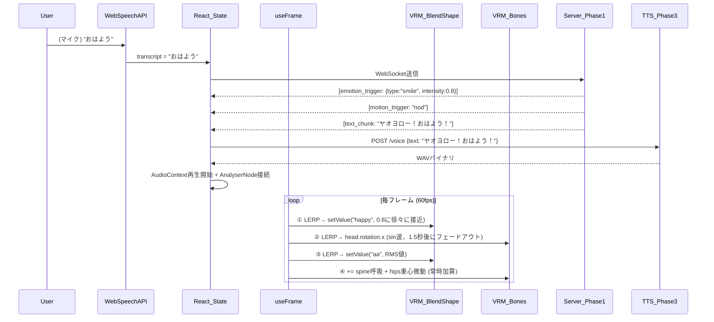

# Phase 2: Avatar & UI 完全計画・技術仕様書

## 0. 2026-05-07 改訂方針（優先）

本節は既存の詳細設計より優先する。詳細な変更仕様は ../PLAN_CHANGE_SPEC_2026-05-07.md を参照する。

- **Phase 2の役割**: Phase 4統合で使うUI/アバターパーツの実証と作成を行う。単体完成より、WebSocket/Audio/VRMの差し替えやすさを優先する。
- **Phase 2での統合範囲**: Phase 4の完全統合までは行わないが、Phase 1との最小統合はこの段階で実施する。最低限、WebSocket接続、`text_chunk` 表示、`emotion_trigger`、`motion_trigger`、`thinking_summary` 表示までをPhase 2の完了条件に含める。
- **アバター制御**: LLM本文中のXMLタグを直接解釈しない。Phase 1の `ControlPlanner` が送る検証済みJSON `ControlPacket` を受け取る。
- **音声入力**: `Web Speech API` 固定をやめ、`SpeechProvider` インターフェースにする。MVPは `BrowserWebSpeechProvider`、ローカルSTTは `ServerWhisperCppProvider`、比較枠は `MoonshineProvider` / `VoskProvider`。
- **思考過程UI**: `thinking_summary`, `plan_summary`, `tool_pending`, `memory_recall` を表示できる小さな状態パネルを追加する。内部chain-of-thought全文ではなく、ユーザー向け短文サマリのみ表示する。
- **HTTPS/PWA**: まずlocalhostで動くことを優先する。スマホマイクやPWAで必要になった時点で Tailscale Serve / mkcert を比較する。
- **後段へ回すもの**: TTS本番統合、リップシンク最終調整、PWA/HTTPSの仕上げ、4プロセス常時同居の安定化はPhase 4中心で行う。
- **LLM切替耐性**: Phase 2は `Qwen3-VL 8B` を前提に最小統合を進めるが、将来 `Gemma 4 26B A4B + MTP` へ比較移行できるよう、UIはモデル名ではなく `ControlPacket` 契約にのみ依存する。

### 0.1 Phase 2の最小統合ゴール

Phase 2はアバター単体の見た目検証だけで終えない。Phase 1のLLMバックエンドと接続し、最低限「脳が出したイベントで身体が反応する」状態まで持っていく。

- `ws://.../chat` などPhase 1のWebSocketへ接続できる
- `text_chunk` を受けてチャットUIへ逐次表示できる
- `emotion_trigger` を受けて表情を切り替えられる
- `motion_trigger` を受けて簡易モーションを再生できる
- `thinking_summary` / `tool_pending` / `memory_recall` を状態パネルに出せる

この時点では、音声の完成形や全プロセス統合までは求めない。Phase 2の役割は、Phase 4で困らないように「LLMイベントがUIで正しく意味を持つ」ことを前倒しで実証すること。

## Part 1: プロダクトビジョンとUI/UX機能要件（何を作るのか）

### 1. プロジェクト目標と画面の役割
フェーズ1（AIの脳）と連携し、相棒である「月見ヤチヨ」の3Dアバターをブラウザ上に描画し、表情・体の動き・口パクをリアルタイムに制御するWebアプリケーション（UI）を構築する。Webアプリとして構築することで、ホストPC上はもちろん、VPN経由でスマホ等の外部デバイスからもアクセス可能な「秘書画面」を提供する。

### 2. アバターの3D描画仕様
- **モデル形式**: VRM形式（glTFベース）。VRChat等で広く使われている標準規格。
- **開発時モデル**: 商用・改変利用が許可された汎用フリーVRMモデルを使用。将来的にヤチヨ専用モデルへ差し替える前提で設計する。
- **描画エンジン**: ブラウザ内の `Three.js`（WebGL）で3D空間を構築し、VRMモデルを配置する。

### 3. アバターの動的制御（4つの独立した制御レイヤー）
VRMモデルは内部的に「BlendShape（メッシュ変形）」と「ボーン（骨格回転）」という**2つの完全に独立したシステム**を持つ。本プロジェクトではこの特性を活かし、以下の4つの制御を**同時に・干渉なく**動作させる。

#### 3.1 表情制御（`<emotion>` タグ → BlendShapeレイヤー）
- フェーズ1が `emotion_trigger` イベントを送信した瞬間、VRMの表情プリセット（BlendShape）を**LERP（線形補間）で滑らかに**切り替える。
- **感情の強度（intensity）対応**: 二値（ON/OFF）ではなく、0.0〜1.0の連続値で表情の強度を制御する。「ちょっと嬉しい(0.3)」と「めちゃくちゃ嬉しい(1.0)」を区別し、自然な表現の幅を持たせる。

| Phase 1 タグ | VRM BlendShape | intensity例 |
|:---|:---|:---|
| `<emotion intensity="0.8">smile</emotion>` | `happy` | 0.8 |
| `<emotion intensity="0.5">sad</emotion>` | `sad` | 0.5 |
| `<emotion>angry</emotion>` (intensity省略時) | `angry` | 1.0（デフォルト） |
| `<emotion>neutral</emotion>` | _(全て0.0へLERP)_ | - |

- **LERP補間の必須ルール（カクつき防止）**:
```typescript
// ❌ 悪い例：値を直接代入するとカクつく
vrm.expressionManager.setValue('happy', targetValue);

// ✅ 正しい例：現在の値から目標値に毎フレーム10%ずつ近づく
const current = vrm.expressionManager.getValue('happy') ?? 0;
const smoothed = current + (targetValue - current) * LERP_FACTOR; // LERP_FACTOR = 0.1
vrm.expressionManager.setValue('happy', smoothed);
```
- **顔面崩壊防止（排他制御）**: `currentEmotion` が `neutral` 以外の間は、自動まばたきタイマーを強制停止する。笑顔中にBlinkが走るとBlendShape値が衝突し、メッシュが崩壊するため。

#### 3.2 身体動作制御（`<motion>` タグ → ボーンレイヤー）
- フェーズ1が `motion_trigger` イベントを送信した際、VRMの骨格（ボーン）を**プロシージャル（コードによる直接回転）**で動かす。
- **外部アニメーションファイル（FBX/GLB）は使用しない。** ボーンマッピング（リターゲティング）の複雑さを回避するため、`Math.sin()` 等の数学関数でボーンの回転角度を毎フレーム計算する。
- **ボーンアクセスAPI**: `vrm.humanoid.getNormalizedBoneNode('head')` で骨に名前でアクセスし `.rotation` を操作する。

**モーション定義表（全プリセット）:**

| タグ値 | 操作ボーン | 軸 | 演算ロジック | 持続時間 | 見た目 |
|:---|:---|:---|:---|:---:|:---|
| `nod` | `head` | X軸 | `sin(t*5) * 0.15` | 1.5秒 | うなずき |
| `tilt_head` | `head` | Z軸 | → 0.2 にLERP | 2.0秒 | 首かしげ |
| `wave` | `rightUpperArm` | Z軸+X軸 | Z=-1.2固定 + X=`sin(t*8)*0.3` | 2.5秒 | 手を振る |
| `think` | `head` + `rightUpperArm` | Z軸+複合 | 首かしげ+手をあごに | 3.0秒 | 考え中 |
| `bow` | `spine` | X軸 | → 0.4 にLERP | 2.0秒 | お辞儀 |

- **モーション寿命管理（自動終了タイマー）**:
  - 各モーションには上記表の「持続時間」が設定されている。
  - `motion_trigger` を受信した瞬間にタイマーを開始する。
  - 持続時間が経過したら、フェーズ（再生中 → フェードアウト → idle）を自動遷移する。
  - 新しい `motion_trigger` が来た場合、現在のモーションを即座にフェードアウトし、新しいモーションを開始する。

```typescript
// useMotion.ts のステートマシン
type MotionPhase = "idle" | "playing" | "fading_out";

interface MotionState {
  currentMotion: string | null;
  phase: MotionPhase;
  startTime: number;       // モーション開始時刻
  durationMs: number;      // 持続時間
  fadeOutMs: number;       // フェードアウト時間（500ms固定）
  progress: number;        // 0.0〜1.0（フェードアウト中の減衰率）
}

// useFrame 内での処理フロー:
// 1. phase === "playing" && 経過時間 > durationMs → phase = "fading_out" に遷移
// 2. phase === "fading_out" → progress を 1.0 → 0.0 に毎フレーム減衰
//    → ボーン回転値に progress を乗算（振幅が徐々にゼロに近づく）
// 3. progress <= 0.01 → phase = "idle" に遷移、全ボーン回転を (0,0,0) に
```

- **LERP補間の必須ルール（体の動きにも適用）**:
```typescript
// ❌ 悪い例：毎フレームリセットしてから値を入れるとカクつく
head.rotation.set(0, 0, 0);
head.rotation.x = motionActive ? Math.sin(t) * 0.15 : 0;

// ✅ 正しい例：目標値に向かって滑らかにLERP
const targetX = motionActive ? Math.sin(t) * 0.15 : 0;
head.rotation.x += (targetX - head.rotation.x) * 0.1; // 毎フレーム10%ずつ接近
```

#### 3.3 口パク / リップシンク（音声波形 → BlendShapeの `aa` のみ）
- フェーズ3（TTS）の音声データを `AudioContext` で再生しつつ、`AnalyserNode` で波形のRMS（二乗平均平方根）をリアルタイム計算し、口BlendShapeに流し込む。
- **RMS計算の数式:**
```javascript
const dataArray = new Float32Array(analyser.fftSize); // fftSize=512
analyser.getFloatTimeDomainData(dataArray);
let sum = 0;
for (let i = 0; i < dataArray.length; i++) sum += dataArray[i] ** 2;
let rms = Math.sqrt(sum / dataArray.length);
let mouth = rms > 0.02 ? Math.min(rms * 3.5, 1.0) : 0; // ノイズゲート + ゲイン正規化
smoothedMouth = smoothedMouth * 0.8 + mouth * 0.2;       // EMAスムージング
vrm.expressionManager.setValue('aa', smoothedMouth);
```

#### 3.4 アイドルアニメーション（常時再生レイヤー）
他の3つの制御系が**何も動いていない待機状態でも、アバターが「生きている」ように見せる**ための常時再生アニメーション。これがないとキャラクターがピクリとも動かず不自然に見えるため、必須の実装項目。

| 動作 | 操作対象 | 演算ロジック | 備考 |
|:---|:---|:---|:---|
| **呼吸** | `spine` ボーン X軸 | `sin(t * 1.5) * 0.008` | 胸がごく微かに上下する |
| **自動まばたき** | `blink` BlendShape | 3〜6秒のランダム間隔で `1.0→0.0` を100msかけて往復 | `currentEmotion !== "neutral"` の間は停止（排他制御） |
| **重心微動** | `hips` ボーン Y軸 + Z軸 | `sin(t * 0.7) * 0.003`（Y）, `cos(t * 0.5) * 0.002`（Z） | 体がごくわずかに揺れる |

- アイドルアニメーションは**常時加算（Additive）**で適用する。モーション再生中でも呼吸は止まらず、体の動きに自然に重畳される。

```typescript
// Idleレイヤー（常に動く。他のモーションに加算される）
const spineB = vrm.humanoid.getNormalizedBoneNode('spine');
const hipsB = vrm.humanoid.getNormalizedBoneNode('hips');
if (spineB) spineB.rotation.x += Math.sin(t * 1.5) * 0.008; // 呼吸
if (hipsB) {
  hipsB.position.y += Math.sin(t * 0.7) * 0.003; // 重心Y微動
  hipsB.position.z += Math.cos(t * 0.5) * 0.002; // 重心Z微動
}
```

#### 3.5 なぜ4つは同時に安全に動くのか（競合しない理由）
```
VRMモデル内部構造:
┌──────────────────────────────────┐
│  BlendShapeレイヤー（メッシュ変形）│ ← ①表情 と ③口パク がここを操作
│  ├─ happy (目・眉・口角)          │    ※①は目・眉を、③は口だけを担当
│  ├─ sad, angry, surprised        │    → パーツが分かれているため競合しない
│  ├─ blink (まぶた)               │    ← ④アイドル(まばたき)がここを操作
│  └─ aa (口の開閉のみ)            │    → 万が一重なったら useEmotionLock で排他
├──────────────────────────────────┤
│  ボーンレイヤー（骨格回転）        │ ← ②体の動き と ④アイドル(呼吸・重心) がここを操作
│  ├─ head, neck                   │    ②は大きな動き、④は微小な加算
│  ├─ spine                        │    → ④は additive（加算）なので②と自然に共存
│  ├─ hips                         │
│  └─ rightUpperArm, rightLowerArm │
└──────────────────────────────────┘
→ 結果: 「笑顔でうなずきながら喋り、呼吸している」が同時動作する
```

### 4. 接触反応（クリック遊び）
画面上のアバター自体をクリック（スマホはタップ）すると、Three.jsの `Raycaster` でヒット判定を行い、ランダムな短いモーション（`wave` や `tilt_head`）を発生させる。

### 5. UIデザインシステム（ヤチヨカラーパレット）
UI全体のカラーリングは「月見＝月夜」の世界観に基づく**ダーク×月光テーマ**を採用する。

| 役割 | カラーコード | 用途 |
|:---|:---|:---|
| ベース（背景） | `#0a0e1a` | 深い夜空の紺。画面全体の地色 |
| アクセント① | `#d4af37` | 月光の淡い金。ボタン枠・入力欄ボーダー・アイコン |
| アクセント② | `#9b8ec4` | 霞む薄紫。ヤチヨの吹き出し左ボーダー・セカンダリUI |
| UIパネル | `rgba(15, 20, 40, 0.75)` | ガラスモーフィズムの半透明パネル地色 |
| テキスト | `#e8e4df` | 月白。純白より温かみのある月明かり色 |
| エラー/警告 | `#e05555` | 接続切断等の警告表示 |

### 6. 画面レイアウト
- **アバター全面型**: 画面の大部分をヤチヨの3Dモデルが占め、チャットパネルは右下にグラスモーフィズムで半透明オーバーレイする。
- **背景**: デフォルトは夜空×月光のイメージ画像。ユーザーが任意の画像をアップロードして変更可能（`localStorage` に保存）。「デフォルトに戻す」ボタンでいつでも初期背景に復帰できる。
- **ダッシュボード**: 右上のトグルボタンで表示/非表示を切り替え。非表示時はアバターとチャットだけのシンプルな画面。
- **接続状態**: 左上に緑/赤ドット＋「Online」「Offline」テキスト。
- **手動カメラ**: `OrbitControls` によるズーム・パン。数値入力による倍率固定。
- **音声入力**: チャット入力欄右端にマイクボタン（`Web Speech API`）。

### 7. レスポンシブデザイン（モバイル対応）
| 画面幅 | レイアウト |
|:---|:---|
| **PC (1024px〜)** | アバター中央全面 + 右下にチャットパネル + 右上ダッシュボードトグル |
| **タブレット (768〜1023px)** | アバター上半分 + チャットパネル下半分（縦分割） |
| **スマホ (〜767px)** | アバター上部1/3 + チャット下部2/3。ダッシュボードはハンバーガーメニューからスライドイン |

- CSSメディアクエリで切り替え。Three.js Canvasのサイズは `window.innerWidth / innerHeight` に追従しリサイズする。
- スマホではOrbitControlsのパン操作をタッチスワイプに対応させる。

### 8. PWA（Progressive Web App）対応
スマホのホーム画面に追加するとネイティブアプリのように起動できるPWA化を行う。
- **`manifest.json`**: アプリ名「月見ヤチヨ」、テーマカラー `#0a0e1a`、アイコン（月のモチーフ）を定義。
- **Service Worker**: Viteの `vite-plugin-pwa` を使用し、アプリシェル（HTML/CSS/JS）をキャッシュ。オフライン時は「ホストPCに接続できません」の画面を表示する。
- **注意**: PWAのオフラインキャッシュはUIシェルのみ。LLM推論・TTS音声生成はホストPC依存のため、通信が切れた場合は対話不能となる。

---

## Part 2: 技術仕様と実装アーキテクチャ詳細（どう作るのか）

### 9. 技術スタック
| カテゴリ | ライブラリ | 役割 |
|:---|:---|:---|
| ビルド | `Vite` + `TypeScript` | 高速ビルド・型安全 |
| UI | `React` | コンポーネントベースUI |
| 3D描画 | `@react-three/fiber` (R3F) | Three.jsのReactラッパー |
| 3Dヘルパー | `@react-three/drei` | OrbitControls等 |
| VRM | `@pixiv/three-vrm` | VRMロード・表情・ボーンAPI |
| 音声解析 | Web Audio API (ブラウザ標準) | リップシンク用RMS計算 |
| 音声入力 | Web Speech API (ブラウザ標準) | マイク→テキスト変換 |
| PWA | `vite-plugin-pwa` | Service Worker生成・manifest管理 |

### 7. ディレクトリ構成
```text
phase2_avatar_ui/
├── package.json, vite.config.ts, tsconfig.json
├── index.html
├── public/models/default.vrm
├── src/
│   ├── App.tsx ..................... 最上位。Context Provider群をネスト
│   ├── constants/
│   │   └── motionPresets.ts ....... 全モーションの定義（ボーン名・軸・振幅・持続時間）
│   ├── contexts/
│   │   └── AgentConnectionContext.tsx ... WebSocket接続管理 + emotion/motion State振り分け
│   ├── components/
│   │   ├── VRMCanvas/
│   │   │   ├── index.tsx .......... R3F <Canvas> + レンダラー設定
│   │   │   ├── YachiyoModel.tsx ... VRMロード + useFrame 統合制御（核心）
│   │   │   ├── MainCamera.tsx ..... OrbitControls + ズームスライダー
│   │   │   └── Lights.tsx ......... 照明配置
│   │   ├── UI/
│   │   │   ├── ChatOverlay.tsx .... チャットログ + テキスト入力 + マイクボタン
│   │   │   ├── Dashboard.tsx ...... ガラスモーフィズム情報パネル
│   │   │   └── StatusBadge.tsx .... 接続状態インジケータ
│   └── hooks/
│       ├── useLipSync.ts .......... AudioContext → RMS → aa BlendShape値
│       ├── useEmotionLock.ts ...... BlendShape排他制御 + まばたき停止
│       ├── useMotion.ts ........... モーションステートマシン + LERP + タイマー管理
│       ├── useIdle.ts ............. 呼吸・まばたき・重心微動の常時再生
│       └── useWebSpeech.ts ........ Web Speech API ON/OFF + テキスト変換
```

### 8. TypeScript 型定義
```typescript
// --- Phase 1 から受信する感情データ（intensity対応） ---
interface EmotionPayload {
  type: "smile" | "sad" | "angry" | "surprised" | "neutral";
  intensity: number; // 0.0〜1.0。省略時は1.0
}

// --- グローバルState ---
interface AgentState {
  isConnected: boolean;
  isThinking: boolean;
  currentEmotion: EmotionPayload;
  currentMotion: string | null;
  chatHistory: Array<{ role: "user" | "yachiyo"; content: string; timestamp: number }>;
}

// --- モーションプリセット定義 ---
interface MotionPreset {
  bones: Array<{
    name: string;           // VRM Humanoidボーン名
    axis: "x" | "y" | "z";
    type: "oscillate" | "lerp_to"; // sin波往復 or 目標角度へLERP
    amplitude: number;      // 振幅（ラジアン）/ 目標角度
    frequency: number;      // 周波数（oscillateの場合のみ）
  }>;
  durationMs: number;       // 再生時間（ミリ秒）
  fadeOutMs: number;        // フェードアウト時間（固定500ms）
}

// --- モーションステートマシン ---
type MotionPhase = "idle" | "playing" | "fading_out";
interface MotionRuntimeState {
  preset: MotionPreset | null;
  phase: MotionPhase;
  startTime: number;
  fadeProgress: number; // fading_out中: 1.0→0.0に毎フレーム減衰
}
```

### 9. `YachiyoModel.tsx` の useFrame 統合ロジック（核心部）
```typescript
const LERP_SPEED = 0.1; // 全ての補間に使用する共通速度

useFrame((state, delta) => {
  if (!vrm) return;
  const t = state.clock.elapsedTime;

  // ========================================
  // レイヤー①: 表情制御 (BlendShape + LERP + intensity)
  // ========================================
  const emotionMap: Record<string, string> = {
    smile: 'happy', sad: 'sad', angry: 'angry', surprised: 'surprised'
  };
  for (const [tagName, vrmName] of Object.entries(emotionMap)) {
    const target = (currentEmotion.type === tagName) ? currentEmotion.intensity : 0;
    const current = vrm.expressionManager.getValue(vrmName) ?? 0;
    // LERP: 毎フレーム目標値に10%ずつ滑らかに接近（カクつき防止）
    vrm.expressionManager.setValue(vrmName, current + (target - current) * LERP_SPEED);
  }

  // ========================================
  // レイヤー②: 体の動き (ボーン回転 + LERP + タイマー管理)
  // ========================================
  // useMotion フックが以下を管理:
  // - phase === "playing": プリセットに従ってボーンを動かす
  // - phase === "fading_out": fadeProgress(1.0→0.0)を振幅に乗算し徐々に停止
  // - phase === "idle": 全ボーン回転の目標値を(0,0,0)とし、LERPでゆっくり戻る
  //
  // 全てのボーン操作はLERPベース。直接代入（.set()）は禁止。
  for (const boneDef of motionState.preset?.bones ?? []) {
    const bone = vrm.humanoid.getNormalizedBoneNode(boneDef.name);
    if (!bone) continue;

    let targetAngle = 0;
    if (motionState.phase === "playing") {
      targetAngle = boneDef.type === "oscillate"
        ? Math.sin(t * boneDef.frequency) * boneDef.amplitude
        : boneDef.amplitude; // lerp_to: 固定角度
    }
    if (motionState.phase === "fading_out") {
      targetAngle *= motionState.fadeProgress; // 振幅を徐々にゼロへ
    }

    // LERP適用（直接代入禁止）
    bone.rotation[boneDef.axis] += (targetAngle - bone.rotation[boneDef.axis]) * LERP_SPEED;
  }

  // ========================================
  // レイヤー③: 口パク (BlendShape: aa のみ)
  // ========================================
  const currentAa = vrm.expressionManager.getValue('aa') ?? 0;
  vrm.expressionManager.setValue('aa', currentAa + (lipSyncRms - currentAa) * 0.2);

  // ========================================
  // レイヤー④: アイドル（常時加算。他レイヤーと共存）
  // ========================================
  // 呼吸: spine の微小上下動（additive）
  const spine = vrm.humanoid.getNormalizedBoneNode('spine');
  if (spine) spine.rotation.x += Math.sin(t * 1.5) * 0.008;

  // 重心微動: hips の微小揺れ（additive）
  const hips = vrm.humanoid.getNormalizedBoneNode('hips');
  if (hips) {
    hips.position.y += Math.sin(t * 0.7) * 0.003;
    hips.position.z += Math.cos(t * 0.5) * 0.002;
  }

  // まばたき: emotion が neutral の時のみ（排他制御）
  if (currentEmotion.type === 'neutral') {
    applyAutoBlink(vrm, t); // 3〜6秒ランダム間隔で blink を 100ms 点滅
  }

  // ========================================
  // VRM内部更新（スプリングボーン = 髪揺れ物理）
  // ========================================
  vrm.update(delta);
});
```

### 10. Three.js レンダラー・照明設定
```typescript
<Canvas gl={{ antialias: true, alpha: true, preserveDrawingBuffer: true }}
  onCreated={({ gl }) => {
    gl.outputEncoding = THREE.sRGBEncoding;
    gl.toneMapping = THREE.ACESFilmicToneMapping;
  }}>
<hemisphereLight skyColor="#ffffff" groundColor="#444444" intensity={0.6} />
<directionalLight position={[1, 1, -1]} intensity={1.0} />
```

### 11. WebSocket再接続とエラーハンドリング
- **指数バックオフ再接続**: 1秒→2秒→4秒→8秒（上限）の間隔で自動再接続。
- **AudioContext Suspend対策**: 初回クリック/タップで `audioContext.resume()` を強制発火。

### 12. システム全体シーケンス図

